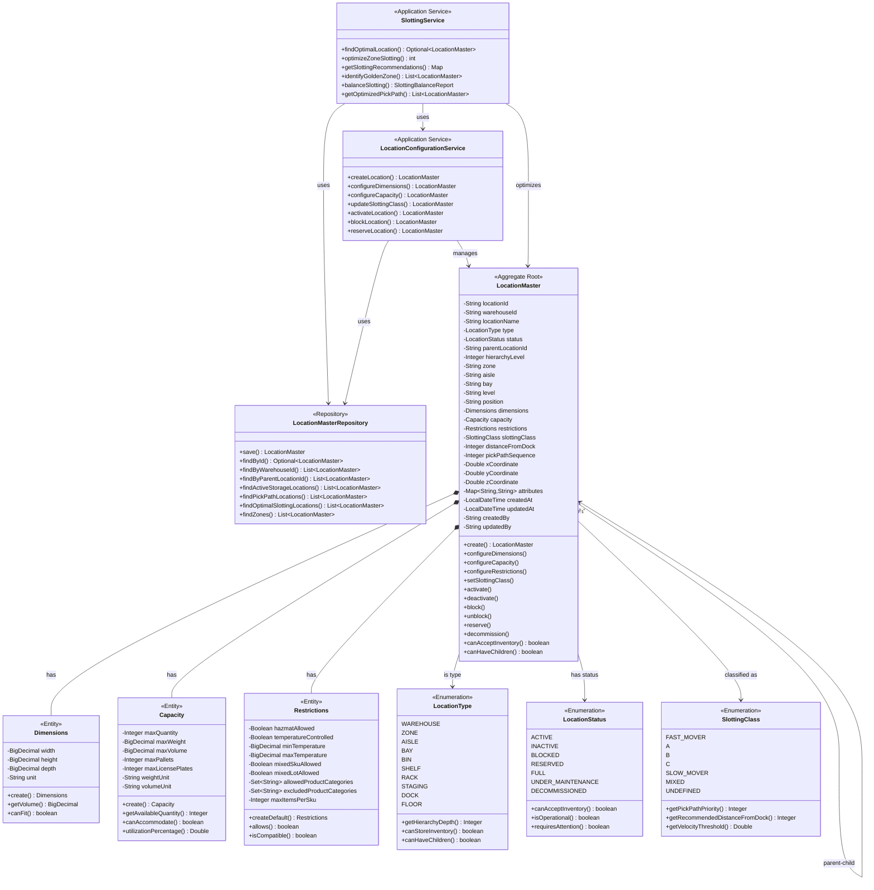
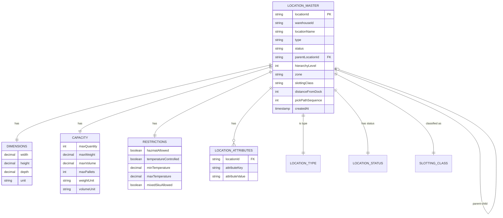

# Location Master Service - Domain Model

## Overview

The Location Master Service domain model represents the physical structure and configuration of warehouse locations in a hierarchical, type-safe manner that enforces business rules and maintains data integrity.

## Domain Model Diagram



## Aggregate Root

### LocationMaster

**Purpose**: Represents a physical location in the warehouse with complete configuration, hierarchy, and operational status.

**Key Responsibilities**:
- Maintain location hierarchy and relationships
- Enforce capacity and dimensional constraints
- Manage slotting classification and pick path sequence
- Control location lifecycle and status
- Store custom attributes for extensibility

**Invariants**:
- Location ID must be unique within warehouse
- Hierarchy level must match location type
- Non-root locations must have valid parent
- Cannot create circular parent-child relationships
- Decommissioned locations cannot be reactivated
- Coordinates must be valid if set

**Business Rules**:

```java
// Hierarchy validation
location.hierarchyLevel == location.type.getHierarchyDepth()
location.hierarchyLevel > 0 => location.parentLocationId != null
location.hierarchyLevel == 0 => location.parentLocationId == null

// Status transitions
ACTIVE <-> INACTIVE (bidirectional)
ACTIVE -> BLOCKED -> ACTIVE (unblock restores to active)
ACTIVE -> RESERVED -> ACTIVE (release restores to active)
ACTIVE/INACTIVE -> DECOMMISSIONED (permanent, no return)

// Capacity acceptance
canAcceptInventory() = status.canAcceptInventory() && type.canStoreInventory()

// Children rules
canHaveChildren() based on LocationType:
  WAREHOUSE, ZONE, AISLE, BAY, RACK: true
  BIN, SHELF, STAGING, DOCK, FLOOR: false
```

## Entities

### Dimensions

**Purpose**: Physical dimensions of the location for space planning and item fitting.

**Attributes**:
- `width`: Horizontal dimension (X-axis)
- `height`: Vertical dimension (Y-axis)
- `depth`: Front-to-back dimension (Z-axis)
- `unit`: Measurement unit (INCHES, CENTIMETERS, METERS)

**Operations**:

```java
// Calculate volume
volume = width * height * depth

// Check if item fits
boolean canFit(BigDecimal itemWidth, BigDecimal itemHeight, BigDecimal itemDepth) {
    return itemWidth <= width &&
           itemHeight <= height &&
           itemDepth <= depth;
}
```

**Example**:
```java
Dimensions pallet = Dimensions.create(
    new BigDecimal("48"),  // 48 inches wide
    new BigDecimal("72"),  // 72 inches high
    new BigDecimal("40"),  // 40 inches deep
    "INCHES"
);
// Volume = 138,240 cubic inches
```

### Capacity

**Purpose**: Maximum storage capacity in multiple dimensions for comprehensive space management.

**Attributes**:
- `maxQuantity`: Maximum item count
- `maxWeight`: Maximum weight capacity
- `maxVolume`: Maximum cubic capacity
- `maxPallets`: Maximum pallet positions
- `maxLicensePlates`: Maximum containers

**Operations**:

```java
// Calculate available capacity
availableQuantity = maxQuantity - currentQuantity

// Check if can accommodate
boolean canAccommodate(Integer qty, BigDecimal weight, BigDecimal volume) {
    return (maxQuantity == null || currentQty + qty <= maxQuantity) &&
           (maxWeight == null || currentWeight.add(weight) <= maxWeight) &&
           (maxVolume == null || currentVolume.add(volume) <= maxVolume);
}

// Calculate utilization
utilization = max(
    currentQty / maxQty,
    currentWeight / maxWeight,
    currentVolume / maxVolume
) * 100
```

**Example**:
```java
Capacity rackPosition = Capacity.create(
    1000,                         // max 1000 items
    new BigDecimal("2000"),       // max 2000 lbs
    new BigDecimal("150"),        // max 150 cubic feet
    "POUNDS", "CUBIC_FEET"
);
```

### Restrictions

**Purpose**: Define what can and cannot be stored in a location for safety, compliance, and operational rules.

**Attributes**:
- `hazmatAllowed`: Can store hazardous materials
- `temperatureControlled`: Requires climate control
- `minTemperature`/`maxTemperature`: Temperature range
- `mixedSkuAllowed`: Can mix different products
- `mixedLotAllowed`: Can mix different lots
- `allowedProductCategories`: Whitelist of categories
- `excludedProductCategories`: Blacklist of categories
- `maxItemsPerSku`: SKU diversity limit

**Operations**:

```java
// Check if product is allowed
boolean allows(Product product) {
    if (product.isHazmat() && !hazmatAllowed) return false;
    if (product.requiresTemperatureControl() && !temperatureControlled) return false;
    if (allowedCategories != null && !allowedCategories.contains(product.category)) return false;
    if (excludedCategories != null && excludedCategories.contains(product.category)) return false;
    return true;
}

// Check compatibility with existing inventory
boolean isCompatible(List<InventoryItem> existingItems, InventoryItem newItem) {
    if (!mixedSkuAllowed && existingItems.stream().anyMatch(i -> !i.sku.equals(newItem.sku))) {
        return false;
    }
    if (!mixedLotAllowed && existingItems.stream().anyMatch(i -> !i.lot.equals(newItem.lot))) {
        return false;
    }
    return true;
}
```

**Example**:
```java
Restrictions coldStorage = Restrictions.builder()
    .temperatureControlled(true)
    .minTemperature(new BigDecimal("35"))
    .maxTemperature(new BigDecimal("40"))
    .hazmatAllowed(false)
    .mixedSkuAllowed(false)
    .build();
```

## Value Objects

### LocationType

Location types with specific characteristics:

| Type | Hierarchy Level | Can Store Inventory | Can Have Children | Description |
|------|----------------|---------------------|-------------------|-------------|
| WAREHOUSE | 0 | No | Yes | Root facility |
| ZONE | 1 | No | Yes | Functional area |
| AISLE | 2 | No | Yes | Physical corridor |
| BAY | 3 | No | Yes | Section in aisle |
| BIN | 4 | Yes | No | Storage bin |
| SHELF | 4 | Yes | No | Shelf position |
| RACK | 3 | No | Yes | Racking structure |
| STAGING | 2 | Yes | No | Temporary area |
| DOCK | 2 | Yes | No | Loading dock |
| FLOOR | 2 | Yes | No | Floor storage |

```java
public enum LocationType {
    WAREHOUSE(0, false, true),
    ZONE(1, false, true),
    AISLE(2, false, true),
    BAY(3, false, true),
    BIN(4, true, false),
    SHELF(4, true, false),
    RACK(3, false, true),
    STAGING(2, true, false),
    DOCK(2, true, false),
    FLOOR(2, true, false);

    private final int hierarchyDepth;
    private final boolean canStoreInventory;
    private final boolean canHaveChildren;
}
```

### LocationStatus

Location lifecycle states:

```java
public enum LocationStatus {
    ACTIVE(true, true, false),           // Operational
    INACTIVE(false, false, false),       // Temporarily disabled
    BLOCKED(false, false, true),         // Safety/maintenance block
    RESERVED(false, false, false),       // Reserved for specific use
    FULL(false, false, false),           // At capacity
    UNDER_MAINTENANCE(false, false, true), // Being serviced
    DECOMMISSIONED(false, false, false); // Permanently retired

    private final boolean canAcceptInventory;
    private final boolean isOperational;
    private final boolean requiresAttention;

    public boolean canAcceptInventory() { return canAcceptInventory; }
    public boolean isOperational() { return isOperational; }
    public boolean requiresAttention() { return requiresAttention; }
}
```

**State Transition Rules**:
```
ACTIVE ⟷ INACTIVE        (reversible)
ACTIVE → BLOCKED → ACTIVE (unblock)
ACTIVE → RESERVED → ACTIVE (release)
* → DECOMMISSIONED       (permanent)
```

### SlottingClass

Velocity-based product classification for optimal placement:

```java
public enum SlottingClass {
    FAST_MOVER(1, 10, 0.05),    // Top 5%, 0-20 units from dock
    A(2, 35, 0.15),             // Next 15%, 20-50 units
    B(3, 75, 0.30),             // Next 30%, 50-100 units
    C(4, 150, 0.40),            // Next 40%, 100-200 units
    SLOW_MOVER(5, 300, 0.10),   // Bottom 10%, 200+ units
    MIXED(6, 100, 0.00),        // Mixed velocity
    UNDEFINED(7, 999, 0.00);    // Not classified

    private final int pickPathPriority;      // Lower = higher priority
    private final int recommendedDistance;    // From dock (units)
    private final double velocityThreshold;   // Percentage of picks

    public int getPickPathPriority() { return pickPathPriority; }
    public int getRecommendedDistanceFromDock() { return recommendedDistance; }
    public double getVelocityThreshold() { return velocityThreshold; }
}
```

**Slotting Strategy**:
- Fast movers in "golden zone" (closest to dock, easiest access)
- A-class items in primary pick area
- B/C-class in secondary pick area
- Slow movers in reserve/bulk storage
- Follows 80-20 rule: 20% of locations handle 80% of picks

## Repository

### LocationMasterRepository

JPA repository with custom query methods:

```java
public interface LocationMasterRepository extends JpaRepository<LocationMaster, String> {
    // Basic queries
    List<LocationMaster> findByWarehouseId(String warehouseId);
    List<LocationMaster> findByParentLocationId(String parentLocationId);

    // Status queries
    List<LocationMaster> findByWarehouseIdAndStatus(String warehouseId, LocationStatus status);
    List<LocationMaster> findActiveStorageLocations(String warehouseId);
    List<LocationMaster> findLocationsRequiringAttention(String warehouseId);

    // Hierarchy queries
    List<LocationMaster> findByWarehouseIdAndHierarchyLevel(String warehouseId, Integer level);
    List<LocationMaster> findZones(String warehouseId);

    // Slotting queries
    List<LocationMaster> findOptimalSlottingLocations(
        String warehouseId, String zone, SlottingClass slottingClass
    );
    List<LocationMaster> findByWarehouseIdAndZoneAndStatus(
        String warehouseId, String zone, LocationStatus status
    );

    // Pick path queries
    List<LocationMaster> findPickPathLocations(String warehouseId, String zone);

    // Spatial queries
    List<LocationMaster> findByWarehouseIdAndZone(String warehouseId, String zone);
}
```

**Custom Queries** (examples):

```sql
-- Find active storage locations
SELECT * FROM location_master
WHERE warehouse_id = :warehouseId
  AND type IN ('BIN', 'SHELF', 'FLOOR')
  AND status = 'ACTIVE'

-- Find optimal slotting locations
SELECT * FROM location_master
WHERE warehouse_id = :warehouseId
  AND zone = :zone
  AND slotting_class = :targetClass
  AND status = 'ACTIVE'
ORDER BY distance_from_dock ASC, pick_path_sequence ASC

-- Find pick path in sequence
SELECT * FROM location_master
WHERE warehouse_id = :warehouseId
  AND zone = :zone
  AND type IN ('BIN', 'SHELF')
  AND status = 'ACTIVE'
ORDER BY pick_path_sequence ASC
```

## Entity Relationships



## Domain Events

### LocationCreatedEvent
```json
{
  "eventType": "LOCATION_CREATED",
  "locationId": "WH-001-PICK-A-01-2-B",
  "warehouseId": "WH-001",
  "type": "BIN",
  "zone": "PICK",
  "parentLocationId": "WH-001-PICK-A-01-2",
  "createdBy": "ADMIN",
  "timestamp": "2025-10-19T10:00:00Z"
}
```

### LocationCapacityChangedEvent
```json
{
  "eventType": "LOCATION_CAPACITY_CHANGED",
  "locationId": "WH-001-PICK-A-01-2-B",
  "warehouseId": "WH-001",
  "previousMaxQuantity": 1000,
  "newMaxQuantity": 1500,
  "reason": "Rack configuration updated",
  "updatedBy": "ADMIN",
  "timestamp": "2025-10-19T11:30:00Z"
}
```

### LocationSlottingChangedEvent
```json
{
  "eventType": "LOCATION_SLOTTING_CHANGED",
  "locationId": "WH-001-PICK-A-01-2-B",
  "warehouseId": "WH-001",
  "previousClass": "B",
  "newClass": "A",
  "pickPathSequence": 1050,
  "reason": "Velocity analysis - upgraded to A-class",
  "updatedBy": "SYSTEM",
  "timestamp": "2025-10-19T14:00:00Z"
}
```

### LocationStatusChangedEvent
```json
{
  "eventType": "LOCATION_STATUS_CHANGED",
  "locationId": "WH-001-PICK-A-01-2-B",
  "warehouseId": "WH-001",
  "previousStatus": "ACTIVE",
  "newStatus": "BLOCKED",
  "reason": "Damaged rack - safety inspection",
  "updatedBy": "SUPERVISOR",
  "timestamp": "2025-10-19T15:45:00Z"
}
```

## Bounded Context

The Location Master bounded context focuses on:
- **IN SCOPE**: Location structure, configuration, capacity, slotting, pick paths
- **OUT OF SCOPE**: Real-time occupancy (Physical Tracking), inventory quantities (Inventory Service), task routing (Task Execution)

**Context Boundaries**:
- Manages location CONFIGURATION, not location STATE
- Defines location CAPACITY, not current UTILIZATION
- Calculates optimal SLOTTING, not actual inventory placement

## Design Patterns

### 1. Aggregate Pattern
- LocationMaster is the aggregate root
- Dimensions, Capacity, Restrictions are part of aggregate
- Transactional consistency within aggregate

### 2. Value Object Pattern
- Enums as immutable value objects
- Self-validating domain concepts
- Type-safe status and classification

### 3. Repository Pattern
- Clean separation of domain and persistence
- Collection-like interface
- Query methods follow domain language

### 4. Domain Events Pattern
- Events published on significant changes
- Enables reactive architecture
- Decouples location configuration from dependent services
