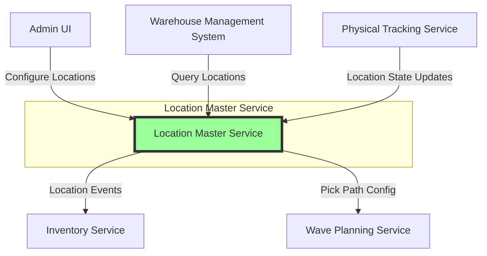

# Location Master Service

## Overview

The Location Master Service is the authoritative source for warehouse location configuration and management in the PakLog WMS. It provides comprehensive location hierarchy management, capacity configuration, slotting optimization, and pick path planning to maximize warehouse efficiency.

## Purpose

This service solves the critical problem of warehouse space optimization by:
- Managing hierarchical location structures (warehouse -> zone -> aisle -> bay -> level -> position)
- Configuring location capacity, dimensions, and restrictions
- Optimizing product-to-location assignments (slotting)
- Calculating optimal pick paths for efficiency
- Managing location lifecycle and status

## Architecture

### Technology Stack

- **Framework**: Spring Boot 3.x
- **Database**: PostgreSQL (Relational for hierarchical and referential integrity)
- **Event Bus**: Kafka for publishing location events
- **API Style**: RESTful HTTP + Event-Driven

### Architectural Style

The service follows **Domain-Driven Design (DDD)** principles with:
- **Aggregate Root**: LocationMaster
- **Entities**: Capacity, Dimensions, Restrictions
- **Value Objects**: LocationStatus, LocationType, SlottingClass
- **Application Services**: LocationConfigurationService, SlottingService
- **Domain Events**: Location lifecycle events

### System Context



## Core Concepts

### Location Hierarchy

Locations are organized in a hierarchical tree structure:

```
Warehouse (WH-001)
├── Zone (RECEIVE)
│   ├── Aisle (A)
│   │   ├── Bay (01)
│   │   │   ├── Level (1)
│   │   │   │   └── Position (A) -> "WH-001-RECEIVE-A-01-1-A"
```

**Hierarchy Levels**:
0. Warehouse (root)
1. Zone (functional area: RECEIVE, PICK, PACK, SHIP, RESERVE)
2. Aisle (physical corridor)
3. Bay (section within aisle)
4. Level (vertical position)
5. Position (specific bin/slot)

### Location Types

Different types of locations serve different purposes:

- **WAREHOUSE** - Root location for facility
- **ZONE** - Functional area (receiving, picking, packing, etc.)
- **AISLE** - Physical corridor in warehouse
- **BAY** - Section within aisle
- **BIN** - Individual storage position
- **SHELF** - Horizontal shelf level
- **RACK** - Vertical racking structure
- **STAGING** - Temporary holding area
- **DOCK** - Loading/unloading dock
- **FLOOR** - Floor storage location

### Location Status

Locations progress through various states:

- **ACTIVE** - Operational and available
- **INACTIVE** - Temporarily not in use
- **BLOCKED** - Blocked for safety/maintenance
- **RESERVED** - Reserved for specific purpose
- **FULL** - At capacity, no space available
- **UNDER_MAINTENANCE** - Being repaired/modified
- **DECOMMISSIONED** - Permanently retired

### Slotting Classes

Slotting determines optimal product placement based on velocity:

- **FAST_MOVER** - Highest velocity items (top 5%)
- **A** - High velocity (next 15%)
- **B** - Medium velocity (next 30%)
- **C** - Low velocity (next 40%)
- **SLOW_MOVER** - Lowest velocity (bottom 10%)
- **MIXED** - Multi-velocity mixed products

**Slotting Principles**:
- Fast movers placed closest to shipping dock
- Pick path optimized by velocity
- Golden zone (prime locations) for A-class items
- 80/20 rule: 20% of locations hold 80% of picks

## Key Features

### 1. Location Configuration
- Create hierarchical location structures
- Configure capacity (quantity, weight, volume)
- Set physical dimensions (width, height, depth)
- Define restrictions (hazmat, temperature, etc.)
- Manage location attributes (metadata)

### 2. Capacity Management
- Multi-dimensional capacity (qty, weight, volume)
- Capacity utilization tracking
- Oversize item handling
- Mixed SKU capacity planning

### 3. Slotting Optimization
- Velocity-based slotting
- Distance-from-dock optimization
- Golden zone identification
- Automatic slotting recommendations
- Seasonal slotting adjustments

### 4. Pick Path Management
- Sequential pick path generation
- Zone-based pick path optimization
- Serpentine routing (S-shape)
- Dynamic path recalculation

### 5. Location Lifecycle
- Activation/deactivation
- Blocking for maintenance
- Reservation for special use
- Permanent decommissioning

### 6. Hierarchy Management
- Parent-child relationships
- Tree navigation
- Bulk operations by zone/aisle
- Hierarchy validation

## API Endpoints

### Location Configuration

```http
POST   /api/locations
GET    /api/locations/{locationId}
GET    /api/locations/warehouse/{warehouseId}
PUT    /api/locations/{locationId}/capacity
PUT    /api/locations/{locationId}/dimensions
PUT    /api/locations/{locationId}/restrictions
DELETE /api/locations/{locationId}
```

### Location Lifecycle

```http
POST   /api/locations/{locationId}/activate
POST   /api/locations/{locationId}/deactivate
POST   /api/locations/{locationId}/block
POST   /api/locations/{locationId}/unblock
POST   /api/locations/{locationId}/reserve
POST   /api/locations/{locationId}/decommission
```

### Slotting and Optimization

```http
GET    /api/locations/warehouse/{warehouseId}/slotting/recommendations
POST   /api/locations/{locationId}/slotting
POST   /api/locations/warehouse/{warehouseId}/slotting/optimize
GET    /api/locations/warehouse/{warehouseId}/golden-zone
GET    /api/locations/warehouse/{warehouseId}/pick-path
```

### Queries

```http
GET    /api/locations/warehouse/{warehouseId}/zone/{zone}
GET    /api/locations/warehouse/{warehouseId}/available
GET    /api/locations/{locationId}/children
GET    /api/locations/search?query={criteria}
```

## Integration Points

### Consumes Events From
- **Physical Tracking Service**: Location state changes, capacity updates
- **Inventory Service**: Stock level changes affecting slotting
- **Wave Planning Service**: Pick path optimization requests

### Publishes Events To
- **Physical Tracking Service**: Location configuration changes
- **Inventory Service**: Capacity and slotting changes
- **Wave Planning Service**: Pick path updates
- **Analytics**: Location performance metrics

## Data Model

The service uses PostgreSQL for robust relational data:

### Tables
- `location_master` - Primary location configuration
- `location_attributes` - Key-value metadata
- Embedded: `capacity`, `dimensions`, `restrictions`

### Indexes
- Primary: `locationId`
- Secondary: `warehouseId`, `parentLocationId`, `zone`, `type+status`
- Composite: `warehouseId+zone+status`, `slottingClass`
- Functional: Pick path sequence ordering

## Configuration

### Environment Variables

```properties
# Database Configuration
spring.datasource.url=jdbc:postgresql://localhost:5432/location_master
spring.datasource.username=paklog
spring.datasource.password=${DB_PASSWORD}

# Kafka Configuration
spring.kafka.bootstrap-servers=localhost:9092

# Slotting Configuration
location-master.slotting.enabled=true
location-master.slotting.auto-optimize=true
location-master.slotting.optimization-schedule=0 0 2 * * ? # 2 AM daily

# Pick Path Configuration
location-master.pick-path.strategy=SERPENTINE
location-master.pick-path.direction=FORWARD
```

## Business Rules

### 1. Hierarchy Rules
- Root locations (warehouses) cannot have parents
- Non-root locations must have valid parents
- Location type must match hierarchy level
- Cannot create circular dependencies

### 2. Capacity Rules
- Capacity cannot be negative
- At least one capacity dimension required for storage locations
- Capacity changes trigger recalculation events
- Over-capacity tolerance: 0-10% configurable

### 3. Slotting Rules
- Fast movers within 20 units of dock
- A-class within 50 units
- B-class within 100 units
- C-class and slow movers beyond 100 units
- Golden zone is top 20% of locations by accessibility

### 4. Status Rules
- Cannot deactivate locations with inventory
- Decommissioned locations cannot be reactivated
- Blocked locations reject all operations
- Reserved locations only accept designated operations

## Slotting Algorithm

### Velocity-Based Slotting

```java
SlottingClass determineOptimalClass(int distanceFromDock) {
    if (distance <= 20) return FAST_MOVER;
    if (distance <= 50) return A;
    if (distance <= 100) return B;
    if (distance <= 200) return C;
    return SLOW_MOVER;
}
```

### Golden Zone Calculation

Golden zone represents the most accessible 20% of locations:
```
GoldenZoneSize = TotalStorageLocations * 0.20
```

Selection criteria:
1. Shortest distance from dock
2. Lowest pick path sequence
3. Best accessibility (aisle position)
4. Optimal ergonomics (waist-level preferred)

### Pick Path Optimization

**Serpentine (S-Shape) Pattern**:
```
Aisle A: Forward  (A-01 -> A-02 -> A-03)
Aisle B: Backward (B-03 -> B-02 -> B-01)
Aisle C: Forward  (C-01 -> C-02 -> C-03)
```

**Sequence Calculation**:
```
pickPathSequence = slottingClass.priority * 1000 + aisleSequence * 100 + baySequence
```

## Monitoring and Metrics

### Key Metrics
- Total locations by type and status
- Capacity utilization by zone
- Slotting class distribution
- Pick path efficiency
- Location lifecycle transitions

### Health Checks
- Database connectivity
- Kafka producer health
- Slotting algorithm performance
- Data consistency validation

## Error Handling

### Common Errors
- `LOCATION_NOT_FOUND` - Location ID doesn't exist
- `INVALID_HIERARCHY` - Parent-child relationship violation
- `INVALID_STATUS_TRANSITION` - Illegal status change
- `CAPACITY_INVALID` - Invalid capacity configuration
- `DUPLICATE_LOCATION` - Location ID already exists

## Performance Considerations

### Scalability
- Horizontal scaling for read-heavy operations
- Database read replicas for queries
- Caching of frequently accessed locations
- Batch operations for bulk updates

### Optimization
- Materialized views for pick path queries
- Denormalized slotting data for fast lookups
- Indexed foreign keys for hierarchy navigation
- Partitioning by warehouse for multi-tenant

## Testing Strategy

### Unit Tests
- Domain model validation
- Slotting algorithm correctness
- Pick path generation logic
- Hierarchy constraint enforcement

### Integration Tests
- Database operations
- Event publishing
- REST API endpoints
- Slotting optimization workflows

### Performance Tests
- Large location hierarchy queries
- Bulk slotting optimization
- Concurrent location updates
- Pick path calculation at scale

## Deployment

### Prerequisites
- PostgreSQL 14+
- Kafka 3.0+
- Java 21+

### Docker Deployment

```bash
docker build -t paklog/location-master-service:latest .
docker run -p 8080:8080 \
  -e SPRING_DATASOURCE_URL=jdbc:postgresql://postgres:5432/location_master \
  -e SPRING_KAFKA_BOOTSTRAP_SERVERS=kafka:9092 \
  paklog/location-master-service:latest
```

## Future Enhancements

1. **3D Visualization**
   - Interactive warehouse map
   - Heat maps for utilization
   - Pick path animation

2. **AI-Driven Slotting**
   - Machine learning for velocity prediction
   - Seasonal pattern recognition
   - Predictive reslotting recommendations

3. **Dynamic Capacity**
   - Real-time capacity adjustment
   - Product mix optimization
   - Cube utilization analytics

4. **Advanced Routing**
   - Multi-picker coordination
   - Congestion avoidance
   - Energy-efficient routing

5. **Integration Enhancements**
   - CAD/BIM integration for layout
   - Warehouse robotics coordination
   - AR/VR location visualization

## Related Services

- **Physical Tracking Service** - Real-time location state
- **Inventory Service** - Product storage and allocation
- **Wave Planning Service** - Pick wave generation
- **Task Execution Service** - Location-based task assignment

## Support and Contacts

- **Team**: Warehouse Configuration Team
- **Slack**: #wms-location-master
- **On-Call**: location-master-oncall@paklog.com
