# Location Master Service - Sequence Diagrams

## Overview

This document contains sequence diagrams for key operational flows in the Location Master Service.

## 1. Create Location Hierarchy

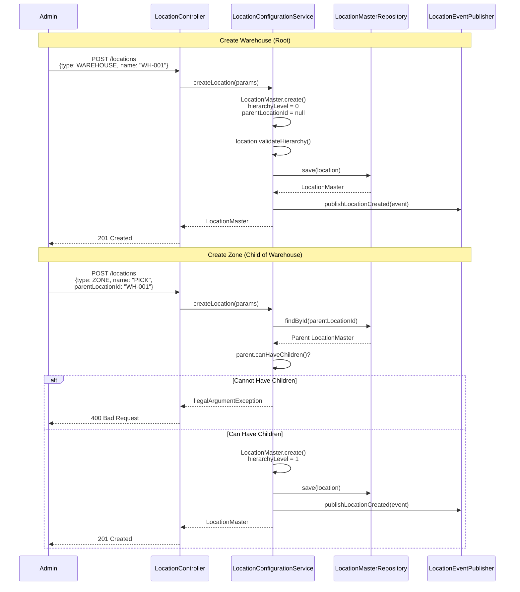

## 2. Configure Location Capacity and Slotting

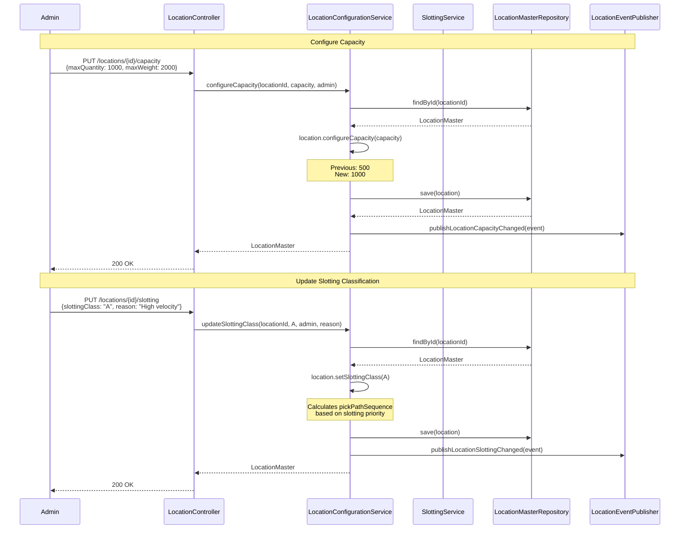

## 3. Optimize Zone Slotting

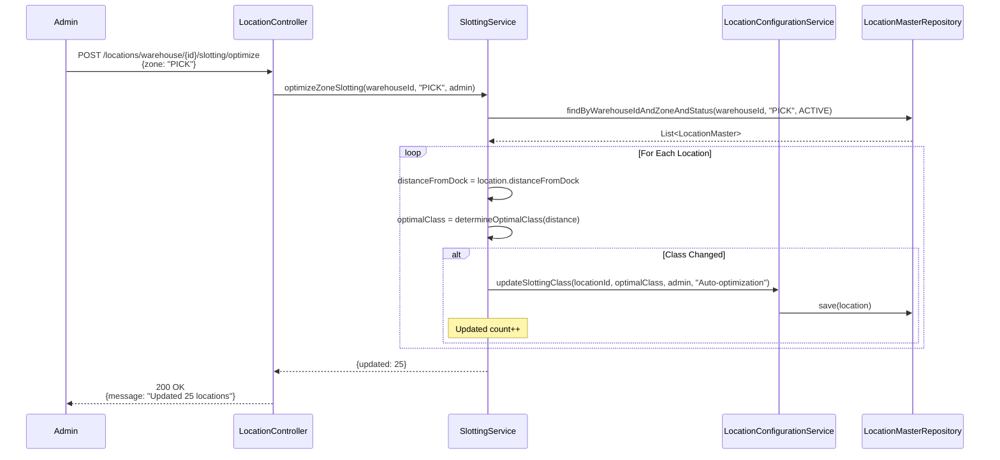

## 4. Find Optimal Location for Product

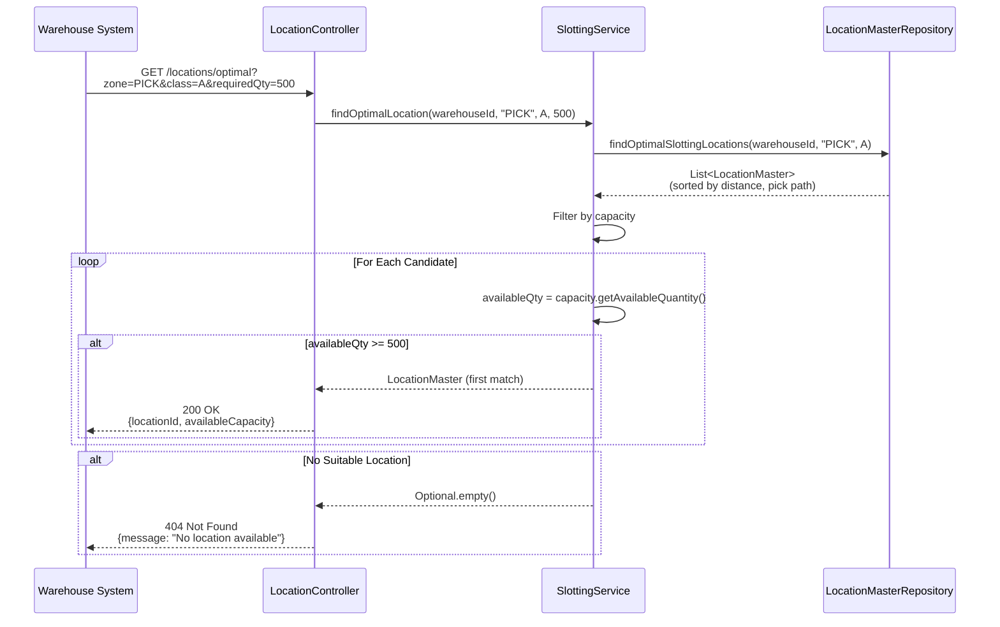

## 5. Block and Unblock Location

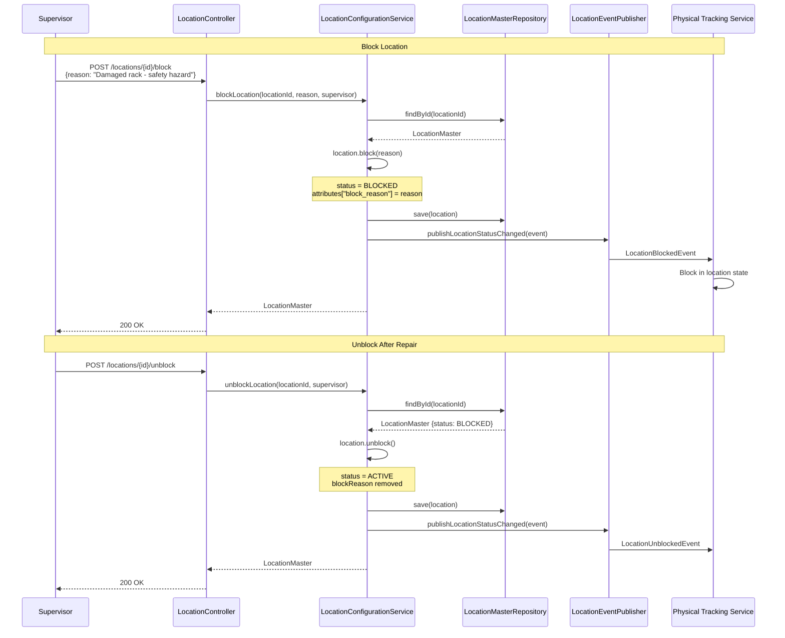

## 6. Get Optimized Pick Path

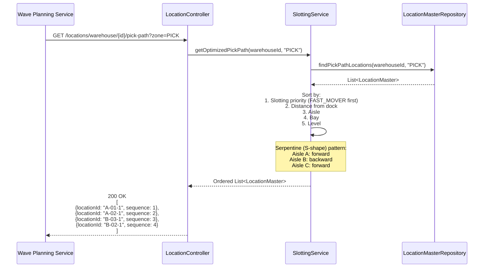

## 7. Identify Golden Zone

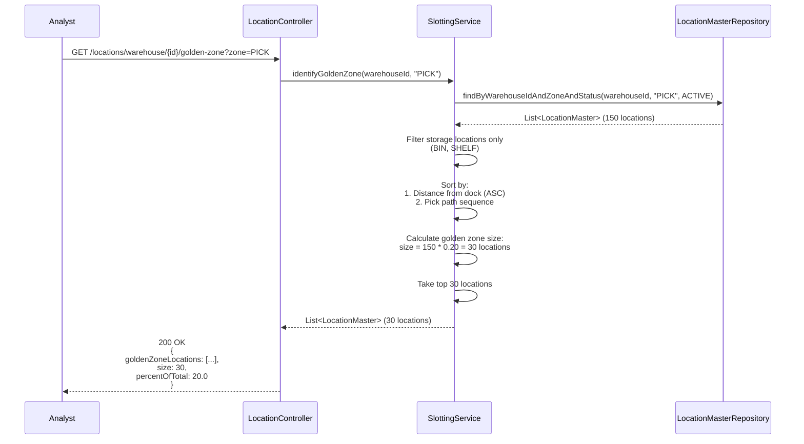

## 8. Slotting Recommendations

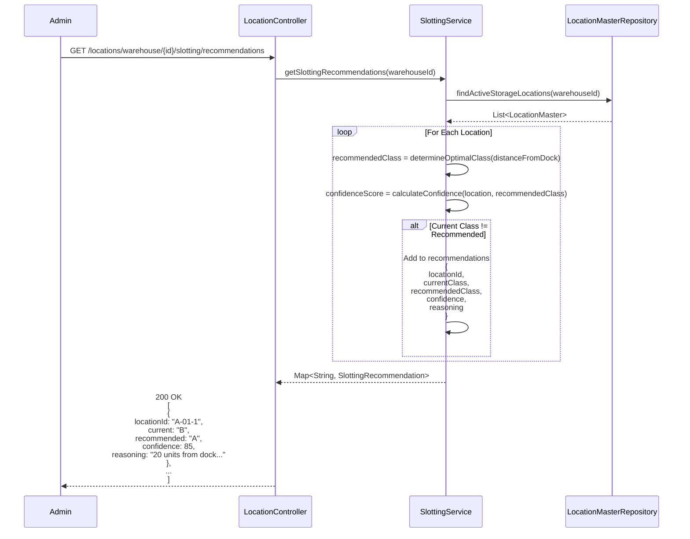

## 9. Balance Slotting Across Zones

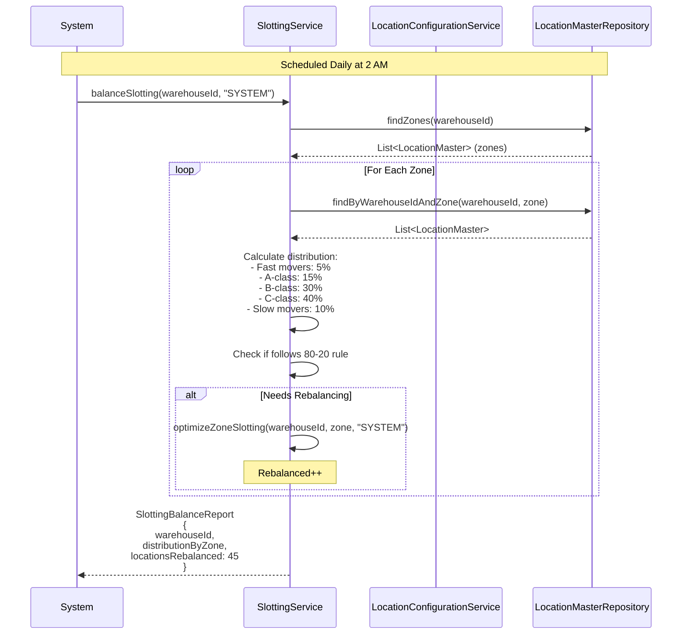

## 10. Query Location Hierarchy

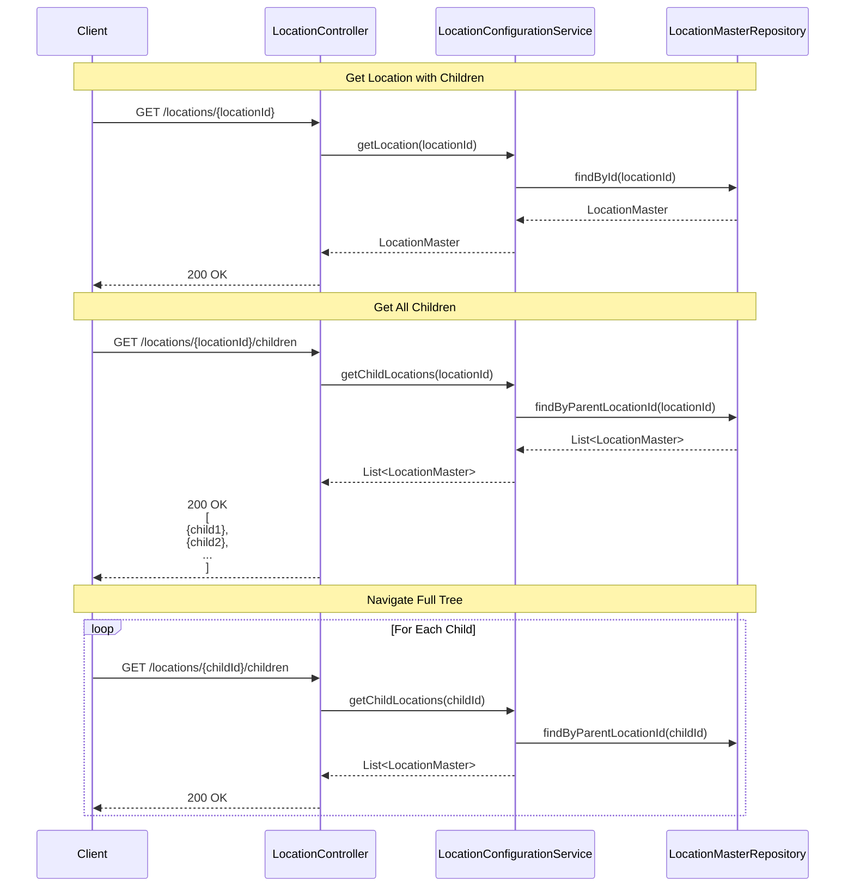

## Error Scenarios

### Invalid Hierarchy
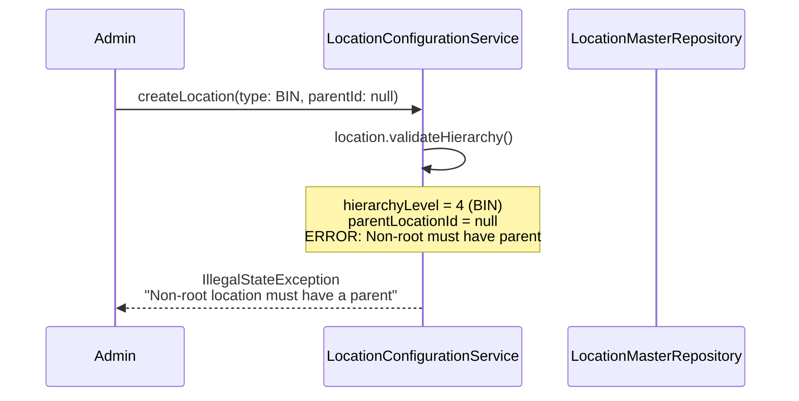

### Cannot Deactivate with Inventory
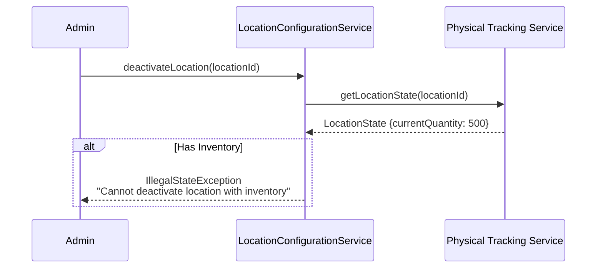
