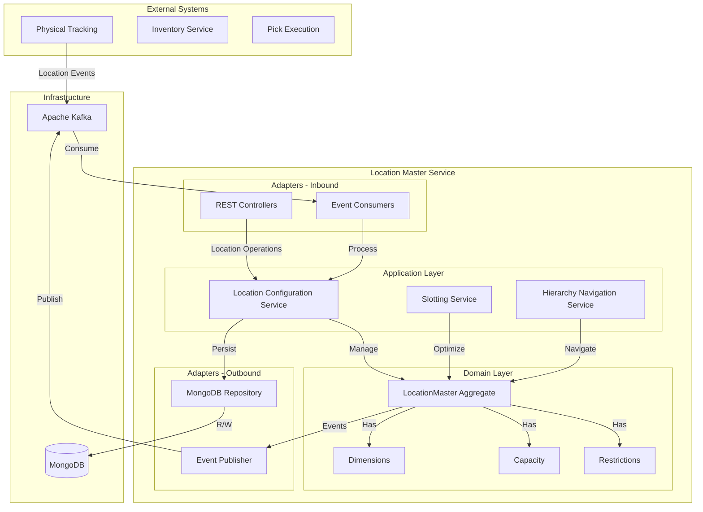

# Location Master Service - Architecture

Warehouse location and zone management with hierarchical structure, capacity management, and intelligent slotting optimization.

## High-Level System Architecture



## Application Services

### Location Configuration Service
- `createLocation(LocationRequest)` - Create new location
- `configureDimensions(String locationId, Dimensions)` - Set dimensions
- `configureCapacity(String locationId, Capacity)` - Set capacity
- `configureRestrictions(String locationId, Restrictions)` - Set restrictions
- `updateSlottingClass(String locationId, SlottingClass)` - Update classification
- `activateLocation(String locationId)` - Activate location
- `blockLocation(String locationId, String reason)` - Block location
- `reserveLocation(String locationId, String reservationId)` - Reserve location

### Slotting Service
- `findOptimalLocation(Product, SlottingCriteria)` - Find best location
- `optimizeZoneSlotting(String zone)` - Re-slot entire zone
- `getSlottingRecommendations(String warehouseId)` - Get suggestions
- `identifyGoldenZone(String warehouseId)` - Find prime locations
- `balanceSlotting(String warehouseId)` - Balance capacity
- `getOptimizedPickPath(String zone)` - Calculate pick sequence

### Hierarchy Navigation Service
- `getChildren(String locationId)` - Get child locations
- `getParent(String locationId)` - Get parent location
- `getAncestors(String locationId)` - Get all ancestors
- `getDescendants(String locationId)` - Get all descendants
- `getLocationPath(String locationId)` - Get full path

## Domain Model

### LocationMaster Aggregate

```java
public class LocationMaster {
    private String locationId;
    private String warehouseId;
    private LocationType type;
    private LocationStatus status;
    private String parentLocationId;
    private Integer hierarchyLevel;
    private Dimensions dimensions;
    private Capacity capacity;
    private Restrictions restrictions;
    private SlottingClass slottingClass;
    private Integer distanceFromDock;
    private Integer pickPathSequence;
    private Coordinates coordinates;

    public void configureDimensions(Dimensions dimensions) {
        validateDimensions(dimensions);
        this.dimensions = dimensions;
        registerEvent(new LocationDimensionsConfigured(this));
    }

    public void configureCapacity(Capacity capacity) {
        validateCapacity(capacity);
        validateAgainstDimensions(capacity);
        this.capacity = capacity;
        registerEvent(new LocationCapacityChanged(this));
    }

    public void block(String reason) {
        validateCanBlock();
        this.status = LocationStatus.BLOCKED;
        this.blockReason = reason;
        this.blockedAt = LocalDateTime.now();
        registerEvent(new LocationBlocked(this, reason));
    }

    public boolean canAcceptInventory() {
        return status == LocationStatus.ACTIVE &&
               !isBlocked &&
               type.canStoreInventory();
    }
}
```

## Slotting Optimization Algorithm

### Find Optimal Location

```java
public Optional<LocationMaster> findOptimalLocation(
    Product product,
    SlottingCriteria criteria
) {
    List<LocationMaster> eligibleLocations = locationRepository
        .findActiveStorageLocations(product.getWarehouseId());

    List<LocationScore> scoredLocations = eligibleLocations.stream()
        .filter(loc -> canAccommodateProduct(loc, product))
        .filter(loc -> meetsRestrictions(loc, product))
        .map(loc -> scoreLocation(loc, product, criteria))
        .sorted(Comparator.comparingDouble(LocationScore::getTotalScore).reversed())
        .collect(Collectors.toList());

    return scoredLocations.isEmpty() ?
        Optional.empty() :
        Optional.of(scoredLocations.get(0).getLocation());
}

private LocationScore scoreLocation(
    LocationMaster location,
    Product product,
    SlottingCriteria criteria
) {
    double velocityScore = calculateVelocityScore(location, product) * 0.40;
    double proximityScore = calculateProximityScore(location) * 0.25;
    double capacityScore = calculateCapacityScore(location, product) * 0.20;
    double ergonomicScore = calculateErgonomicScore(location) * 0.15;

    return new LocationScore(
        location,
        velocityScore + proximityScore + capacityScore + ergonomicScore
    );
}
```

### Golden Zone Identification

```java
public List<LocationMaster> identifyGoldenZone(String warehouseId) {
    return locationRepository.findByWarehouse(warehouseId).stream()
        .filter(loc -> loc.getType().canStoreInventory())
        .filter(loc -> isInGoldenZone(loc))
        .sorted(Comparator.comparingInt(LocationMaster::getDistanceFromDock))
        .collect(Collectors.toList());
}

private boolean isInGoldenZone(LocationMaster location) {
    Coordinates coords = location.getCoordinates();

    // Golden zone height: 30-60 inches from floor
    boolean optimalHeight = coords.getZ() >= 30 && coords.getZ() <= 60;

    // Golden zone distance: within 50 feet of dock
    boolean optimalDistance = location.getDistanceFromDock() <= 50;

    return optimalHeight && optimalDistance;
}
```

### Zone Slotting Optimization

```java
public SlottingResult optimizeZoneSlotting(String zone) {
    List<LocationMaster> zoneLocations = locationRepository.findByZone(zone);
    Map<SlottingClass, List<LocationMaster>> locationsByClass = groupBySlottingClass(zoneLocations);

    int reallocationCount = 0;

    // Place fast movers in golden zone
    List<LocationMaster> goldenZone = identifyGoldenZone(zoneLocations);
    List<LocationMaster> fastMovers = locationsByClass.get(SlottingClass.FAST_MOVER);

    for (int i = 0; i < Math.min(goldenZone.size(), fastMovers.size()); i++) {
        LocationMaster location = goldenZone.get(i);
        if (location.getSlottingClass() != SlottingClass.FAST_MOVER) {
            location.setSlottingClass(SlottingClass.FAST_MOVER);
            reallocationCount++;
        }
    }

    // Optimize pick path sequence
    updatePickPathSequence(zoneLocations);

    return new SlottingResult(reallocationCount, calculateImprovement());
}
```

## Database Design

### LocationMaster Collection

```json
{
  "_id": "A1-01-02",
  "locationId": "A1-01-02",
  "warehouseId": "warehouse-1",
  "locationName": "Aisle A1, Bay 01, Level 02",
  "type": "BIN",
  "status": "ACTIVE",
  "parentLocationId": "A1-01",
  "hierarchyLevel": 4,
  "zone": "A1",
  "aisle": "01",
  "bay": "02",
  "level": "02",
  "dimensions": {
    "width": 48.0,
    "height": 12.0,
    "depth": 40.0,
    "unit": "INCHES"
  },
  "capacity": {
    "maxQuantity": 500,
    "maxWeight": 1000.0,
    "maxVolume": 20.0,
    "maxPallets": 2,
    "weightUnit": "LBS",
    "volumeUnit": "CUBIC_FEET"
  },
  "restrictions": {
    "hazmatAllowed": false,
    "temperatureControlled": false,
    "mixedSkuAllowed": false,
    "mixedLotAllowed": true,
    "allowedProductCategories": ["ELECTRONICS", "TOYS"],
    "maxItemsPerSku": 100
  },
  "slottingClass": "A",
  "distanceFromDock": 75,
  "pickPathSequence": 42,
  "xCoordinate": 10.5,
  "yCoordinate": 20.3,
  "zCoordinate": 48.0,
  "attributes": {
    "rackType": "SELECTIVE",
    "hasLighting": true
  },
  "createdAt": "2025-01-15T10:00:00Z",
  "updatedAt": "2025-10-19T10:00:00Z"
}
```

### MongoDB Indexes

```javascript
db.locations.createIndex({ "locationId": 1 }, { unique: true })
db.locations.createIndex({ "warehouseId": 1, "type": 1, "status": 1 })
db.locations.createIndex({ "warehouseId": 1, "zone": 1 })
db.locations.createIndex({ "parentLocationId": 1 })
db.locations.createIndex({ "warehouseId": 1, "slottingClass": 1 })
db.locations.createIndex({ "warehouseId": 1, "pickPathSequence": 1 })

// Geospatial index
db.locations.createIndex({
  "xCoordinate": 1,
  "yCoordinate": 1,
  "zCoordinate": 1
})

// Text index for search
db.locations.createIndex({
  "locationName": "text",
  "locationId": "text"
})
```

## Pick Path Sequence Calculation

### Serpentine Pattern

```java
public void updatePickPathSequence(List<LocationMaster> locations) {
    // Group by aisle
    Map<String, List<LocationMaster>> byAisle = locations.stream()
        .collect(Collectors.groupingBy(LocationMaster::getAisle));

    // Sort aisles
    List<String> sortedAisles = new ArrayList<>(byAisle.keySet());
    sortedAisles.sort(Comparator.naturalOrder());

    int sequence = 1;

    for (int i = 0; i < sortedAisles.size(); i++) {
        String aisle = sortedAisles.get(i);
        List<LocationMaster> aisleLocations = byAisle.get(aisle);

        // Sort by bay
        aisleLocations.sort(Comparator.comparing(LocationMaster::getBay));

        // Reverse for odd aisles (serpentine)
        if (i % 2 == 1) {
            Collections.reverse(aisleLocations);
        }

        for (LocationMaster location : aisleLocations) {
            location.setPickPathSequence(sequence++);
        }
    }

    locationRepository.saveAll(locations);
}
```

## Configuration

```yaml
# Location Configuration
location:
  cache:
    details-ttl: 15m
    hierarchy-ttl: 1h
  capacity:
    alert-threshold: 90

# Slotting Configuration
slotting:
  golden-zone:
    height-min: 30  # inches
    height-max: 60  # inches
    distance-max: 50  # feet from dock
  fast-mover:
    threshold: 100  # picks per week
  optimization:
    batch-size: 1000

# MongoDB
spring:
  data:
    mongodb:
      uri: mongodb://localhost:27017/location-master
      auto-index-creation: true
```

## Performance Optimizations

### Caching Strategy
- Location details cached for 15 minutes
- Hierarchy relationships cached for 1 hour
- Slotting classifications cached
- Pick path sequences cached

### Slotting Optimization
- Batch processing for large zones
- Incremental updates for single locations
- Pre-calculated golden zones
- Cached distance calculations

### Database Optimization
- Compound indexes for common queries
- Geospatial index for coordinate queries
- Text index for search
- Connection pooling

## Monitoring Metrics

- Total locations by type
- Active vs. blocked locations
- Location utilization by zone
- Slotting class distribution
- Golden zone occupancy
- Pick path optimization score
- Configuration change rate
- Capacity violation count
